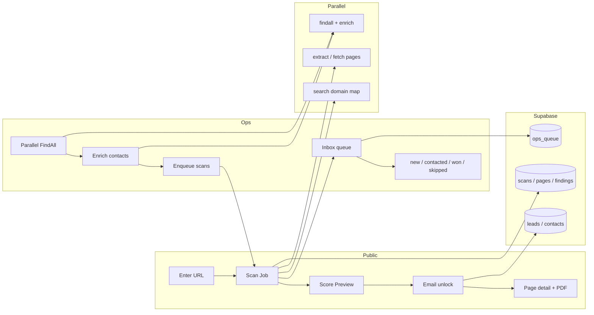
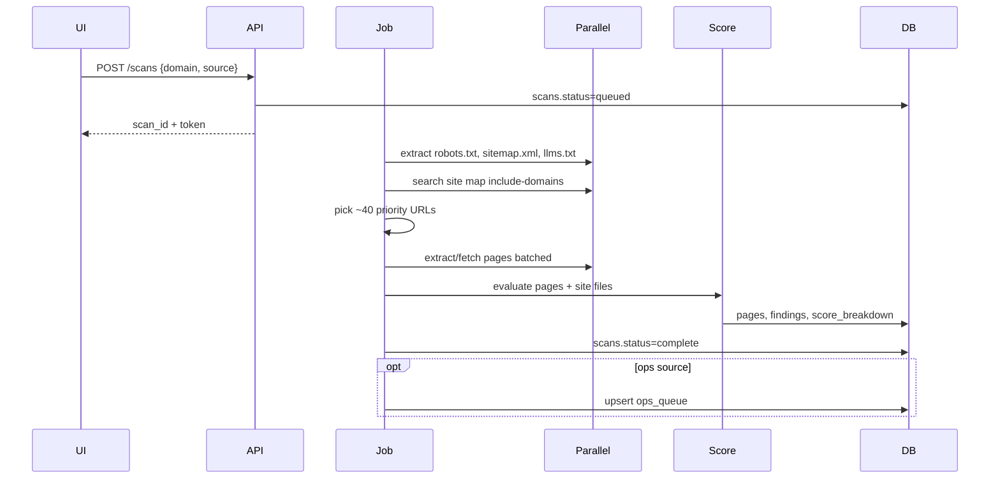

# AEO / GEO Readiness Scanner — Design Spec

**Date:** 2026-08-11  
**Status:** Approved — implementation plan at `docs/superpowers/plans/2026-08-11-aeo-geo-readiness-scanner.md`  
**Workspace:** Standalone app in `Schema`  
**Approach:** Monolith Next.js app (Approach 1)

## 1. Problem

Businesses need a free way to see how prepared they are for AEO (Answer Engine Optimization) and GEO (Generative Engine Optimization). Operators also need an outbound pipeline that discovers companies, enriches contacts, automatically scores sites, and queues weak sites for outreach.

## 2. Goals

- Analyze websites automatically for structured JSON-LD / schema.org markup, `llms.txt`, sitemap/robots AI-crawl signals, and related readiness factors.
- Show an overall readiness score and page-level detail (which pages have / lack structured data).
- Use **Parallel only** for discovery, mapping, and page extraction (no Firecrawl in v1).
- Dual product from day one:
  - **Public soft-gated scanner** (score free; email unlocks page detail + PDF).
  - **Ops inbox** (FindAll → enrich → scan → queue with statuses).
- Internal contact queue only in v1 (no CRM sync).

## 3. Non-goals (v1)

- Firecrawl (or any non-Parallel crawl/map/scrape provider)
- CRM integrations (HubSpot, Salesforce, etc.)
- Deep crawls (~100 pages)
- Multi-tenant agency white-label
- LLM-based subjective scoring
- Public user accounts

## 4. Product decisions (locked)

| Decision | Choice |
|---|---|
| Product motion | Both public scanner + outbound ops |
| Fetch / map / scrape | Parallel only (`search`, `extract`/`fetch`, `findall`, `enrich`) |
| Contact queue | In-app ops inbox (`new` / `contacted` / `won` / `skipped`) |
| Deployment home | Standalone app in this `Schema` workspace |
| Free report gate | Soft gate: overall score immediate; email for page detail + PDF |
| Scan depth | Standard: site files + up to ~40 priority pages |
| Architecture | Next.js monolith + Supabase + async scan jobs |

## 5. System architecture

### Layers

- **Web (Next.js App Router + shadcn):** public scanner, report, ops inbox
- **App services:** scan orchestrator, Parallel client, scoring engine, PDF generator, lead capture
- **Jobs:** async scan runs (~40 pages) so the UI stays responsive
- **DB (Supabase):** scans, page results, findings, unlocks, leads, contacts, ops queue; Auth for staff only
- **Parallel:** FindAll/enrich for prospecting; domain-scoped search for URL map; extract/fetch for pages and site files

Shared scan/score core is used by both public and ops paths.

## 6. Data model

Public visitors are not accounts. Only ops staff authenticate via Supabase Auth.

| Entity | Purpose |
|---|---|
| `scans` | One audit run: domain, source (`public` \| `ops`), status, overall score, score breakdown, timestamps, public token |
| `scan_pages` | Up to ~40 URLs per scan: url, page_type, fetch status, has_json_ld, schema_types[] |
| `scan_findings` | Checks: code, severity, pass/fail, evidence, optional page_id |
| `scan_unlocks` | Soft gate: email + scan_id |
| `leads` | Companies from FindAll/enrich or public opt-in: name, domain, website, industry, raw Parallel payload |
| `contacts` | People on a lead: name, title, email, phone, source confidence |
| `ops_queue` | Inbox: lead_id, latest_scan_id, status, priority score, notes |
| `staff_profiles` | Supabase Auth user id + role (`ops`); RLS uses this for `/ops` |

### Relationships

- `leads` 1—* `contacts`
- `leads` 1—* `scans` (public scans may have no lead until opt-in)
- `scans` 1—* `scan_pages`; findings belong to scan (optional page)
- `ops_queue` *—1 `leads`, *—1 latest `scans`

### Score snapshot

Store on `scans`: `score_total` (0–100) and `score_breakdown` JSON so historical reports do not recompute.

### RLS sketch

- **Public:** create scan by domain; read scan by opaque token; write unlock email for that scan
- **Ops:** full read/write on leads, contacts, queue, all scans

## 7. Parallel scan pipeline

One orchestrator powers public and ops scans. Parallel is the only fetch layer.

### Steps

1. Normalize domain → canonical origin.
2. Extract site files: `/robots.txt`, `/sitemap.xml` (and sitemap index children when present), `/llms.txt`, optionally `/llms-full.txt`.
3. Build URL map via Parallel `search` with `--include-domains` plus sitemap URLs (no Firecrawl map/crawl).
4. Prioritize up to ~40 pages: home, about, contact, services/products, pricing, FAQ, blog index, location pages, top sitemap entries.
5. Extract pages in batches; objective focused on JSON-LD / schema.org / FAQ / Organization markup; use full content when needed to capture script blocks.
6. Detect structured data: parse `application/ld+json`; record types (`Organization`, `LocalBusiness`, `FAQPage`, `Product`, `Article`, etc.) and basic validity flags.
7. Score and persist. If `source=ops`, refresh `ops_queue`.

### Outbound feed (ops)

1. `findall` for ICP natural-language objective.
2. `enrich` for website + emails/phones.
3. Upsert `leads` / `contacts` → enqueue scans → inbox sorted by opportunity.

### Limits and resilience

- Cap 40 pages per scan; retry transient Parallel failures; mark individual pages `failed` without failing the whole scan when possible.
- Use Parallel cache / max-age where available.
- Re-scan creates a new `scans` row (history retained).
- Dedupe leads by domain.

## 8. Scoring model

Overall **0–100** readiness score (shown before email). Deterministic rules only in v1.

| Pillar | Weight | Checks |
|---|---|---|
| Structured data | 35 | JSON-LD on key pages; useful schema.org types; valid `@context`/`@type`; Org/LocalBusiness on home; FAQ/Product/Article where relevant |
| AI discovery files | 20 | `/llms.txt` exists and is useful; optional `/llms-full.txt`; sitemap present and parseable |
| AI crawlability | 20 | `robots.txt` allows major AI bots (GPTBot, ClaudeBot, PerplexityBot, Google-Extended, etc.) or does not blanket-block |
| Page coverage | 15 | % of scanned pages with any JSON-LD; critical templates (home/contact/service) covered |
| Answer readiness | 10 | FAQ schema, clear Q&A blocks, Organization contact / sameAs signals |

### Outputs per scan

- `score_total` + `score_breakdown` per pillar
- Page matrix: URL → has JSON-LD, types, pass/fail
- Findings with codes such as `MISSING_LLMS_TXT`, `NO_JSON_LD_HOME`, `ROBOTS_BLOCKS_GPTBOT`, `SITEMAP_MISSING` (`info` / `warn` / `critical`)
- Top 5 priority fixes by score impact

### Rules

- Missing page fetch does not zero an entire pillar; page is `unknown`, excluded from coverage %, with a finding.
- Ops priority ≈ opportunity: lower score + usable contact → higher inbox rank.

## 9. Public UX (soft gate)

1. Landing: brand + CTA “Check your AI visibility” + URL field (AI Blind Spot positioning; see `docs/brand-guidelines.md`).
2. Progress while job runs (map → extract → score).
3. **Without email:** overall score, pillar bars, top 3 critical gaps (no page list).
4. **Gate:** email required for page-level matrix, full findings, and PDF.
5. **After unlock:** page matrix, site files status, findings, fix list, PDF download.
6. Optional CTA “Want us to implement this?” → create/update lead and optional `ops_queue` row (`new`) on opt-in.

### Constraints

- No public accounts
- Rate limit by IP and domain to control Parallel spend
- Tokenized share links; page detail still requires unlock
- shadcn UI; mobile-first report

## 10. Ops inbox

Staff-only (`/ops`, Supabase Auth). In-app queue only.

### Inbox list

- Sorted by opportunity (low score + has contact first)
- Columns: company, domain, score, contacts count, status, last scanned, source (`findall` / `public_opt_in`)
- Filters: status, score band, industry, has email
- Bulk: re-scan, mark contacted / skipped

### Statuses

`new` → `contacted` → `won` | `skipped`

### Lead detail

- Same score engine as public report
- Page matrix + findings
- Contacts from Parallel enrich
- Notes + status changes
- Actions: Re-scan, copy outreach blurb (score + top gaps), open live site

### Prospecting panel

- ICP natural-language objective → Parallel `findall` → `enrich` → leads → auto-enqueue scans
- Progress for long FindAll/enrich runs
- Domain dedupe

### UI (shadcn)

Table, Badge, Tabs, Sheet/Drawer, Dialog, Form/Field, Select, Sidebar, Sonner

## 11. Error handling and limits

| Case | Behavior |
|---|---|
| Parallel page timeout / 5xx | Retry up to 2× with backoff; page `failed`; scan can still complete |
| Parallel outage | Scan `failed`; clear message + retry |
| Invalid / unreachable domain | Fail fast before bulk extracts |
| Partial page success | Score from successful pages; `PAGES_FETCH_FAILED` finding |
| Missing sitemap | Fall back to domain-scoped Parallel search only |
| Public abuse | Rate limit 3 scans / domain / day (tunable); hard cap 40 pages |
| Ops FindAll | Staff auth required; show estimated cost/time before start |
| Unlock | Validated email; unlocks that `scan_id` only |
| Enrich with no email | Queue still created; flag `missing_contact` |
| Re-scan | New scan row; history retained; status transitions audited |

## 12. Testing (TDD)

Parallel is mocked at the client boundary.

| Layer | Coverage |
|---|---|
| Scoring unit | Fixture HTML/markdown → pillar scores, findings, page matrix |
| Detector unit | JSON-LD extraction, schema types, robots AI-bot rules, llms.txt present/empty |
| Orchestrator integration | Mocked Parallel site files + N pages → DB rows + score |
| API | Create scan, poll status, unlock gate, detail forbidden until unlock |
| Ops | Queue transitions, domain dedupe, FindAll→enrich→enqueue (mocked) |
| E2E smoke | Public URL → score preview → email unlock → page table visible |

**Fixtures:** healthy site (JSON-LD + llms.txt), empty site, blocked bots, partial sitemap.

**v1 definition of done:** scoring + detectors green; public soft-gate flow green; ops inbox status + enqueue green; one mocked end-to-end scan path.

## 13. Suggested tech stack

- Next.js (App Router), TypeScript, Tailwind, shadcn/ui
- Supabase (Postgres, Auth, RLS)
- Background jobs: Inngest (Next.js-compatible queue)
- Parallel API via typed server client (SDK/HTTP; never call Parallel from the browser)
- PDF: server-side HTML→PDF of unlocked report
- Vitest + Playwright for unit/integration and smoke E2E

## 14. Milestone sketch (for implementation plan)

1. Scaffold app + Supabase schema + RLS
2. Parallel client + detectors + scoring (TDD)
3. Scan orchestrator job (~40 pages)
4. Public soft-gate report + PDF
5. Ops auth + inbox + prospecting (FindAll/enrich)
6. Rate limits, hardening, smoke E2E

## 15. Open follow-ups (explicitly deferred)

- Exact Parallel API auth/key storage layout in deployment
- Final numeric thresholds inside each scoring pillar (implemented with tests + tunable constants)
- PDF visual design
- Exact public rate-limit numbers after cost calibration
- CRM sync (post-v1)
